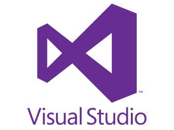
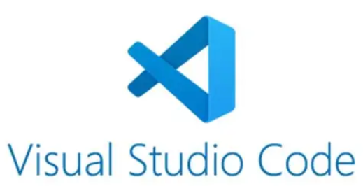
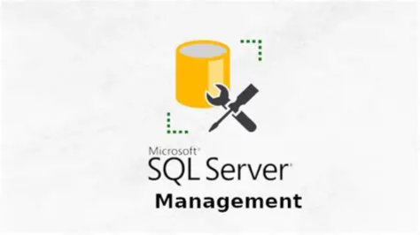
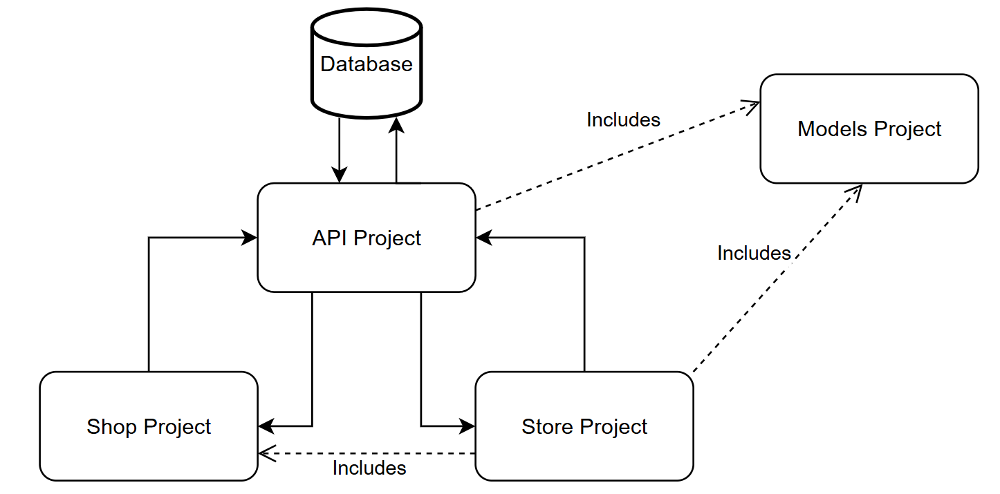

# ShopBu
## Introdution
It is an intermediary sales website where users can post and purchase products.
## Tools
 

## System operation structure

### Detail
- API Project (C# language): API platform
- Store Project (C# language): For users registering to sell their products
- Shop Project (Js language): For shoppers
- Models Project (C# language): Models library (not for use)  
## How to use
1. Paste .env.local file into Shop Project and appsettings into API Project 3.1. $2a$12$xiy6BA.fpsedPuoZ/DsYpO3Xg5SoODipH5u5LG8vutqXwwKyLQf3q
2. Reference Models Project with API Project and Store Project
3. Run API Project, Store Project using Visual studio 2022
4. Shop Project wil run 2 cmd linked to codes folder:
- Cmd 1:
> npx json-server data/db.json
- Cmd 2:
> npm run dev
